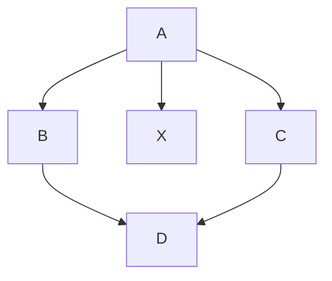
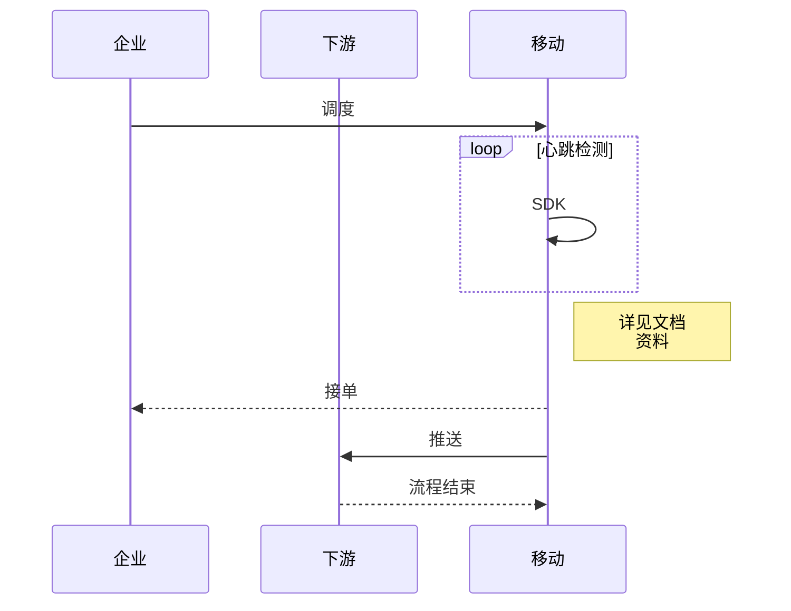

```mermaid
st=>start: Start
e=>end: End
接收用户名和密码=>operation: 接收用户名和密码
使用用户名查询数据库=>operation: 使用用户名查询数据库
数据库中是否有数据=>condition: 数据库中是否有数据?
走登录逻辑=>operation: 走登录逻辑
走注册逻辑=>operation: 走注册逻辑
密码是否正确=>condition: 密码是否正确?
把用户名和密码写入数据库=>inputoutput: 把用户名和密码写入数据库 

st->接收用户名和密码->使用用户名查询数据库->数据库中是否有数据
数据库中是否有数据(yes)->走登录逻辑->密码是否正确
数据库中是否有数据(no)->走注册逻辑->把用户名和密码写入数据库->e
密码是否正确(yes)->e
密码是否正确(no,down)->接收用户名和密码
```





